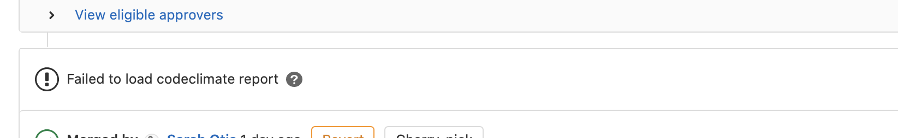
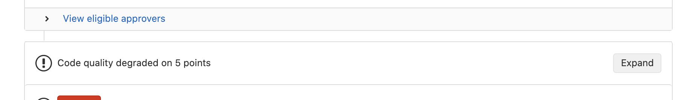

# HACK-1089


Pink Panther is a light framework that programatically checks and eliminates the usage of biased language in any Splunk code repository.

# Quickstart

If you are ready to integrate our framework into your CI, open your `.gitlab-ci.yml` and do the following:

1. List the project as an item under your included YAML files:
    ```sh
      include:
        ...
        ...
        # include biased language template (https://cd.splunkdev.com/engprod/pink-panther/-/blob/main/biased_lang.yml)
        - project: engprod/pink-panther
          file: biased_lang.yml
        ...
    ```
2. List the stage `biased_lang` to match the included external template above:

    ```sh
      stages:
        ...
        ...
        - biased_lang
        ...
    ```

    **Note: You may exclude directories and files from the biased language scan.** For instructions on how, see the section on [Excluding directories and files](README.md#excluding-directories-and-files). This may be useful if you have contractual dependencies on code where biased language cannot be removed yet.

3. Merge into your CI

    When you merge this biased language stage into your GitLab CI for the first time, look for a job named `Detecting Biased Language` in any pipelines triggered. It will pass if no biased terms are found, and it will [fail without impacting the rest of the CI](https://docs.gitlab.com/ee/ci/yaml/#allow_failure) if terms are found.

    Check that the merge request shows a Code Climate widget with this message:

    

    The widget is working, but still needs a baseline for future diffs. (This widget shows only instances that new contributions would introduce.) Once these changes are merged, the `Detecting Biased Language` job can run in the repository's main pipeline, creating that baseline for all future merge requests. By the second merge request, you should already see “Code Quality degraded...” wherever it degraded:

    

Congratulations! Pink Panther is ready to use in the CI.

Have a question? See our [FAQ](README.md#frequently-asked-questions) or head to [#bias-language-removal-eng](https://splunk.slack.com/archives/C018QV7J5L2) on Slack.

# Developer Instructions

Follow these instructions to set up Pink Panther locally for development.

## Required Dependencies

-   python 3.7+
-   ripgrep (Installation instructions [here](https://github.com/BurntSushi/ripgrep#installation). On MacOS, `brew install ripgrep`.)

## Run locally

1. Clone the repository

    ```sh
    git clone https://cd.splunkdev.com/engprod/pink-panther.git
    cd pink-panther
    ```

2. Create a virtual environment -- _optional, but recommended_

    ```sh
    # Creating an environment called env
    python3 -m venv env
    source env/bin/activate
    ```

3. Install `requirements.txt`.
    ```sh
    pip install -r requirements.txt
    ```
4. Run pink-panther, either in standard mode or in JSON mode.
    ```sh
    # standard output
    python run.py [args]
    # JSON output
    python run_json.py [args]
    ```

## Standard output vs JSON output

**Standard output:** `run.py` offers colored, easy-to-read terminal output. An argument available only for standard output: `--mode=fix`.

**JSON output:** `run_json.py` outputs formatted JSON summaries, can send results to Splunk, and has additional options that are helpful for GitLab CI pipelines.
Arguments available only for JSON output: `--err_file`, `--splunk`, `--url`, and `--splunk_logs`.

## More on [args]

Unless otherwise noted, all arguments are available for both JSON and standard output. Required arguments: `--path` and `--mode`.

-   **`--path`** [_**required**_] absolute path to the directory
    ```sh
    python run.py --path=/user/jdoe/git/myProject/
    ```
-   **`--mode`** [_**required**_] `check` to scan for bias language | `fix` to make replacements
    ```sh
    python run.py --mode=check
    ```
-   **`--excluded_dirs_path`** relative path to `path` argument
    ```sh
    python run.py --excluded_dirs_path=.excluded_dirs
    ```
-   **`--excluded_files_path`** relative path to `path` argument
    ```sh
    python run.py --excluded_files_path=.excluded_dirs_files
    ```
-   **`--verbose`** enables explicit logging (only applicable for check mode)
    ```sh
    python run.py --verbose
    ```
-   **`--err_file`** sends any error messages to a log file of your choice, in addition to the console
    ```sh
    python run_json.py --err_file <yourfile.log>
    ```
-   **`--splunk`** Splunks results (see [Splunking Results](README.md#splunking-results))
    ```sh
    python run_json.py --splunk
    ```
-   **`--url`** Works with `--splunk` flag present. By default, `sourcetype` in Splunk logs is set to `local-<hostname>`. This flag instructs Pink Panther to set `sourcetype` to the git hostname URL:
    ```sh
    # CI environment (e.g. GitLab CI) --> sourcetype = "cd.splunkdev.com"
    python run_json.py --splunk --url=${CI_JOB_URL}
    # Locally --> sourcetype = "local-<hostname>"
    python run_json.py --splunk
    ```
-   **`--splunk_logs`** sends counts of Splunked events to log file `biased_language.log`.
    ```sh
    python run_json.py --splunk_logs
    ```
-   **`--splunk_token`** is the Splunk HEC token to POST events to internal Splunk instance
    ```sh
    python run_json.py --splunk_token=${token}
    ```
-   **`--github_repo`** is the name of the GitHub repository if tool is run in GitHub Actions. This is included as the `source` when POSTing to Splunk instance.

### Usage Examples

`pink-panther` will be run in its own dir and can target any other project through the `--path` arg.

Minimal usage if cloned into your current project:

```sh
# standard output
python run.py --mode=check --path=/user/jdoe/git/myProject
# JSON output
python run_json.py --mode=check --path=/user/jdoe/git/myProject
```

Full usage example:

```sh
# standard output
python run.py --mode=check --path=/user/jdoe/git/myProject --excluded_dirs_path=.excluded_dirs --excluded_files_path=.excluded_files --verbose
# JSON output
python run_json.py --mode=check --path=/user/jdoe/git/myProject --excluded_dirs_path=.excluded_dirs --excluded_files_path=.excluded_files --verbose --err_file <yourfile.log> --splunk
```

## Understanding the JSON output

#### biased-language-summary.json

`biased-language-summary.json` contains a summary of which files contain which biased words.
(With `--verbose`, this output is capable of line-by-line reporting instead of a summary. The GitLab CI uses the summarized version.)

```sh
{
    "terms_found": "true" | "false",
    "mode": "check",
    "verbose": "true" | "false",
    "total_lines_matched": 295,
    "total_files_matched": 54,
    "total_words_matched": 449
    "biased_words": [list of biased words to be checked],
    "biased_word_1": { # for each biased word
        "biased_word": "biased_word_1",
        "files": [list of absolute paths to files containing biased terminology],
        "lines": [ # field included only if verbose = true. list of JSONs with details of each line found
            {
                "line": "content of line containing biased language",
                "location": see `location` field of codeclimate spec
            },
            ...
        ],
        "num_matched_lines": 8,
        "num_matched_files": 4,
        "num_matched_words": 11
    }
}
```

#### biased-language.codeclimate.json

`biased-language.codeclimate.json` contains a line-by-line report, organized by biased word, of every biased term in the repository and its location. The spec for it can be found [here](https://docs.gitlab.com/ee/user/project/merge_requests/code_quality.html#implementing-a-custom-tool).

**Note** that if data is [sent to Splunk](README.md#splunking-results), the following fields will automatically be added to any Splunked JSON output for easier searching.

| Field            | Type    | Example Values                         | Description                                                                                                                                                                                                                                                                                                                                                                                          |
| ---------------- | ------- | -------------------------------------- | ---------------------------------------------------------------------------------------------------------------------------------------------------------------------------------------------------------------------------------------------------------------------------------------------------------------------------------------------------------------------------------------------------- |
| `time`           | String  | `1607725426.3648682_2020_-0800`        | `<seconds>.<milliseconds>_<year>_<timezone>`: time field containing [floating point number](https://docs.python.org/3/library/time.html#time.time) (expressed in seconds since the epoch, in UTC), year, and timezone offset.                                                                                                                                                                        |
| `uuid`           | String  | `7228ee6b-ee18-447f-86aa-de7f89e626dc` | Unique identifier generated per job (each complete Pink Panther scan) for easily "grouping" events together in Splunk.                                                                                                                                                                                                                                                                               |
| `line`           | String  | `if master_node_down: # Healthcheck`   | A string containing biased language in your project. Certain lines in a repository can be too long to be readable. In this case, Pink Panther truncates the `line` value for any line of more than 144 characters. If there are multiple biased words in a single line, this field will contain multiple truncated lines separated by a `\n`. Present only in Code Climate events, not summary JSON. |
| `line_truncated` | Boolean | `true` or `false`                      | Boolean value whether `line` has been truncated or not; present only in Code Climate events, not summary JSON.                                                                                                                                                                                                                                                                                       |
| `content`        | String  | `biased-language.codeclimate.json`     | `content` will equal `biased-language.codeclimate.json` or `biased-language-summary.json`, respective of its JSON.                                                                                                                                                                                                                                                                                   |
| `total_lines`    | Int     | `8473`                                 | Total line count of repo, but excluding those files and directories in `.excluded_dirs` & `.excluded_files`.                                                                                                                                                                                                                                                                                         |
| `run_time`       | Float   | `.83`                                  | Run time of Pink Panther on the targeted repo.                                                                                                                                                                                                                                                                                                                                                       |

---

## Formatting of word_list.csv

When running, `1 to 1` option the `biasedWord` will be directly replaced by the `allowedWord` if `--mode=fix`.
When running with many options it won't replace automatically, but it show your provided options for your context.

```sh
# 1 to many options
biasedWord,"option1,option2"
# 1 to 1 option
biasedWord,allowedWord
```

## Excluding directories and files

To exclude certain directories and files in your repo from the scan, add these custom files to specify which directories and/or files you wish to exclude:

-   Any directories in an `.excluded_dirs` file will contain the names of directories that will be recursively excluded.
-   Likewise, the `.excluded_files` file will contain the names of files that will be excluded.

Include the path to these files in the and `--excluded_dirs_path` and `--excluded_files_path` arguments, respectively.
Note that these paths are relative to the main path provided to `--path`.
Filetypes to ignore can be added as `*.extension`.
**Caution:** Please do not include any empty lines in these files. Each line of the file represents something to ignore in the search.

Examples:

```sh
# .excluded_dirs
node_modules
build
env
.git
```

```sh
# .excluded_files
README.md
*.test.js
build/index.js
```

## Splunking Results

Using the `--splunk` flag in JSON mode will send the results of each scan for biased language to Splunk.

When this flag is specified:

-   The JSON `biased-language-summary.json` is sent to Splunk.
-   If biased terms are found, the JSON biased-language.codeclimate.json is sent to Splunk. You will find each biased word found with its details as its own individual event when searching in Splunk. To search all events from a specific Pink Panther run to see the complete scan, you can group by the uuid property when searching. For example:

    ```sh
    index="bias_language" source="core-ee/splcore-main"| spath uuid | search uuid="83356492-a334-4b24-b62c-bae87be7c94b"
    ```

-   For debugging purposes, a `biased_language.log` file with logging information is included. Anything of type `INFO` is sent to Splunk.

To see results in Splunk:

1. Visit [our managed Splunk Enterprise instance](https://hannibal.sv.splunk.com/)
2. Search `index="bias_language" source="<your-group-name>/<your-repo-name>` (e.g. `index="bias_language" source="engprod/pink-panther"`)

Happy Splunking!

## Frequently Asked Questions

**Q: My `Biased Language Detection` job passed with warnings, but I didn't add any new instances of biased language. What does this mean?**

**A:** Every time a pipeline runs with the `biased_lang` stage, it scans the entire repository.
If the pipeline detects biased language anywhere in the repository, the `biased_lang` stage will pass with warnings and show an orange exclamation point instead of a green check.
To see instances you have added, look at the Code Quality/codeclimate diff that appears as a widget in your merge request.

**Q: I see all these instance of biased language in the Code Quality report that I didn't add. What is going on?**

**A:** The diff in Code Quality uses line number along with some other information to calculate whether an instance of biased language is new or not. When the Code Quality widget highlights instances of biased language in the file you're changing, please take the opportunity to eliminate the biased language in that file.

**Q: Though the Code Quality widget won't work in my first merge request with the biased language tool, I still want a report of all the biased terms in my branch. How can I see this report?**

**A:** If your branch contains no biased language, then the `Biased Language Detection` job will show a green check upon completion. If your branch contains any biased language, the pipeline will instead show an orange exclamation point for that job.

Follow the instructions in [Splunking Results](README.md#splunking-results) to see the results that the CI pipeline has sent to Splunk.

Alternatively, if you prefer to see the instances of biased language directly from the pipeline, pipeline artifacts offer information:

1. Click on the `Biased Language Detection` job in your merge request pipeline. You should see console output for the job.
   On the right-hand side of the page, past the job's console, look for a section called `Job artifacts`.
   Click to download the job's artifacts.
2. Open the zip file that downloaded. You'll see two JSON files which you can view in Chrome or in your IDE.
   See [Understanding the JSON output](README.md#understanding-the-json-output).

**Q: Certain instances of biased terms in my repository would break dependent code from outside the repo if I fixed them. What do I do?**

**A:** Please remove the instances that you can. Then, you may exclude files and/or directories from the biased language scan in your merge request by following the instructions in [Excluding directories and files](README.md#excluding-directories-and-files).

## Learn More:

-   Info about the CI stages: [doc](https://docs.google.com/document/d/1eX0cLBL8Z4WLXBKia1vkzIcr90NwQ_GgyPPAVXRS4LU/edit)
-   Sendur's statement: [Biased Language Has No Place In Tech](https://www.splunk.com/en_us/blog/leadership/biased-language-has-no-place-in-tech.html)
-   See which other repositories in GitLab are using Pink Panther in their _default_ branch: [go/bias-language/gitlab](http://go/bias-language/gitlab)
-   Pink Panther Splunk dashboard data: [go/pinkpanther/dash](http://go/pinkpanther/dash)
-   Biased Language Terminology Replacement Guide: [go/biasfreeguide](http://go/biasfreeguide)
-   Section on biased language in Splunk's Engineering Handbook: [go/handbook/biaslanguage](http://go/handbook/biaslanguage)
-   Project page for biased language: [go/bias-language/project](http://go/bias-language/project)
-   Join the Slack channel: [#bias-language-removal-eng](https://splunk.slack.com/archives/C018QV7J5L2)
